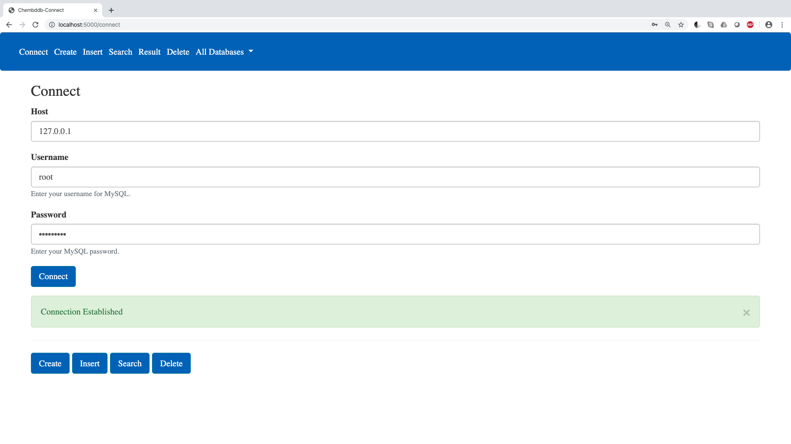
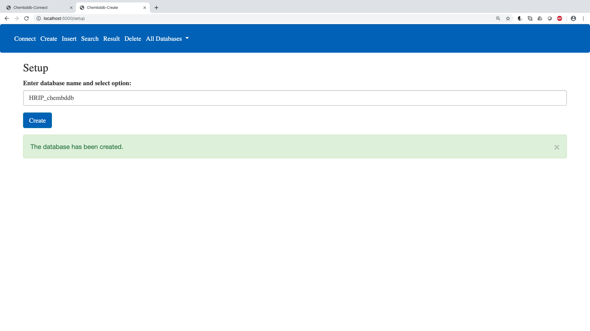
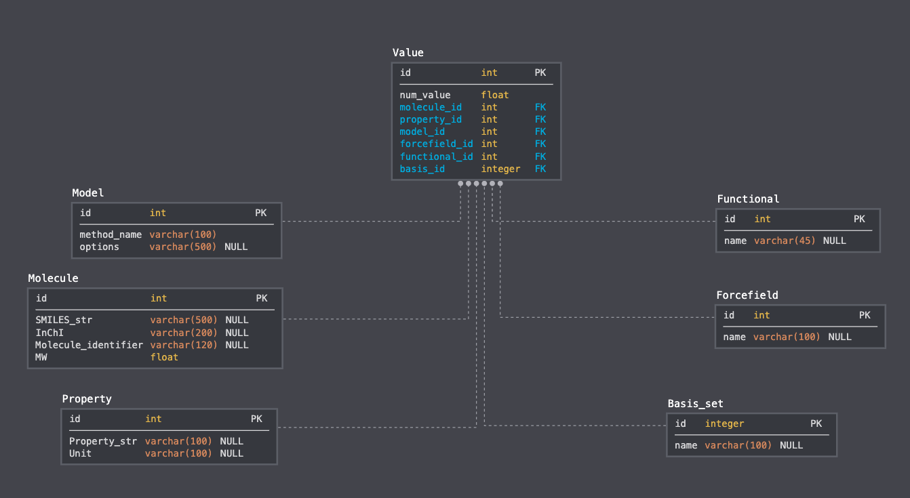
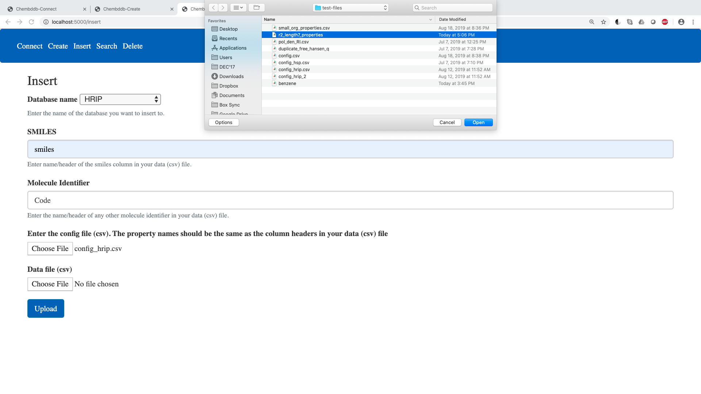
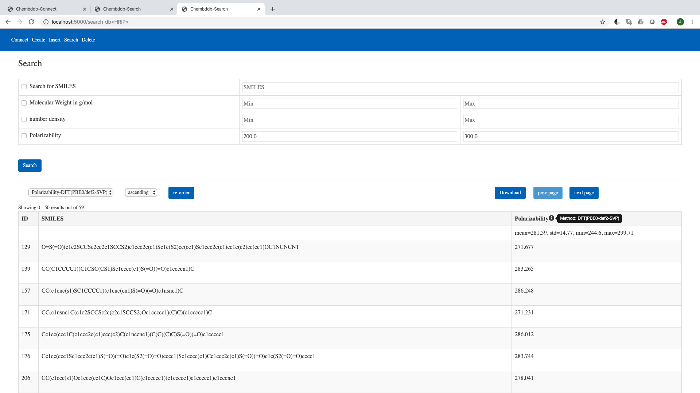
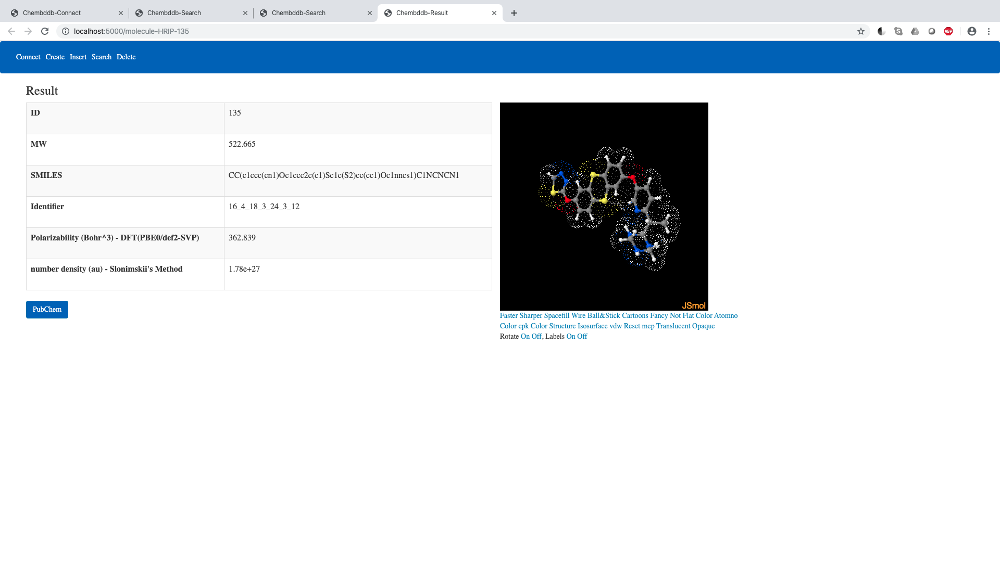
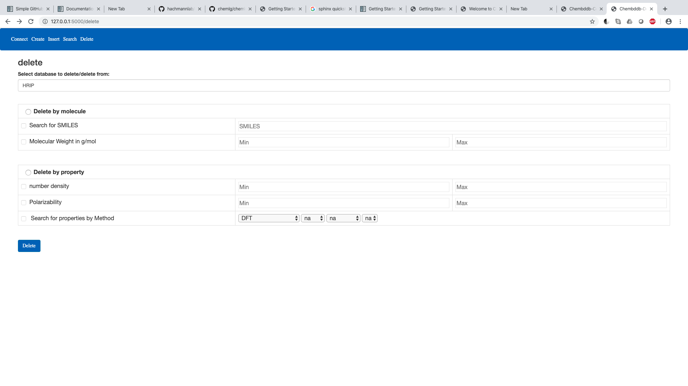

Getting started with ChemBDDB
=============================

The chembddb module is executed from the following command line:

.. code:: bash

    chembddbshell

This command will work on mac os and ubuntu. For windows users `WSL <https://docs.microsoft.com/en-us/windows/wsl/install-win10>`_ is required. 

With ChemBDDB, 4 tasks can be performed:

- setup: sets up a mysql database with the chembddb schema

- insert: inserts data from csv files into the database

- search: searches for molecules within the database using different search criteria

- delete: deletes specific data from the database or deletes the entire database as per required

Before these four tasks, chembddb requires the user to connect to their mysql server using the host, username and password that was decided during mysql installation. 

    
Setup
+++++

- enter the name of the database that needs to be set up 

- the database will be created with the following schema

- tables in the database:

    - Property: consists properties and relevant units
    .. image:: ./images/property.png
       :width: 30%
       :align: center
       :alt: property table

    - Model: consists of all methods that were used to calculate properties, along with details/options
    .. image:: ./images/model.png
       :width: 35%
       :align: center
       :alt: model table

    - Molecule: consists of details for each molecule in the database, for example, SMILES, InChI, molecular weights, and other relevant identifiers
    .. image:: ./images/molecule.png
       :width: 60%
       :align: center
       :alt: molecule table

    - Functional: if a quantum chemical method was used to calculate the property, this table stores the name of the functional that was used
    .. image:: ./images/functional.png
       :width: 15%
       :align: center
       :alt: functional table
    
    - Basis_set: if a quantum chemical method was used to calculate the property, this table stores the name of the basis set that was used
    .. image:: ./images/basis_set.png
       :width: 15%
       :align: center
       :alt: basis_set table

    - Forcefield: if a molecular modeling approach was used to calculate the property, this table stores the name of the forcefield that was used
    .. image:: ./images/forcefield.png
       :width: 15%
       :align: center
       :alt: forcefield table

    - Value: this table stores the values corresponding to each molecule computed with a specific method; this table is the main/central table in the schema and it has a many-to-many relationship with all other tables
    .. image:: ./images/value.png
       :width: 60%
       :align: center
       :alt: value table

Insert
++++++

- on the insert page the user is first required to select a database from a list of all databases created using the ChemBDDB schema

- in order to insert data into the database, 2 types of csv files are required:

    - a meta-data file: this file consists of all the meta-data (i.e., the properties, along with their units and the methods used to calculate them)
    .. image:: ./images/config.png
       :width: 80%
       :align: center
       :alt: config file

    - a data file: this file consists of the actual data that the user needs to enter into the database
    .. image:: ./images/data.png
       :width: 80%
       :align: center
       :alt: data file

these files can be uploaded directly on the browser

- the name of the SMILES column, and the names of any other columns refering to an identifier for molecules in the data file needs to be provided in the fields provided on the insert page

Search
++++++

- the user can search the database using a single or multiple search criteria together, these criteria include:

    - search using a range of values for any given property
    - search using a range of values for molecular weight
    - search using SMILES or SMARTS
    - search using a given method

.. image:: ./images/search1.png
    :width: 90%
    :align: center
    :alt: search page

- other functionalities relevant to search include 
    
    - downloading the results as a csv file
    - re-arranging the results in ascending or descending order
    - at any point, the user can view the method that was used to calculate the property that is displayed in the results
    - the user can view some statistics (mean, standard deviation, minimum, and maximum value) for the results that are displayed
    - for the sake of efficiency, the results are displayed 50 at a time

- when the user clicks any row in the results section, it takes them to a page designated for that molecule, which contains all the information that the database contains about that molecule, along with a link to search for the molecule on PubChem

- this page also visualizes the molecule using the JSmol applet, with many variations, and the ability to download the image, as well as the xyz geometries that are used to construct them

Delete
++++++

- the user can also delete entries from a database, or delete the entire database

- the user has to first select the database that they want to delete/delete from

- the user then has a choice to delete by molecule, or delete by property

- if all fields are left blank when the delete button is clicked, the database will be deleted

